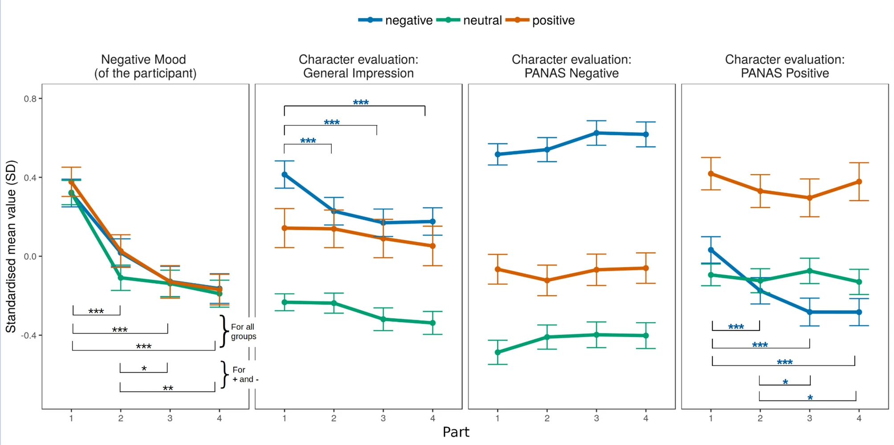
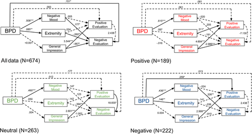

# Memory and the borderline personality trait
What do you think determines what you remember from a movie? Or from an everyday conversation? Do you think your recall differs if you talk to a sympathetic versus a non-sympathetic person? And how do these factors change for people with a high borderline personality trait, that is those who are emotionally unstable? 

We aimed to answer this question with an exciting project using advanced, well thought-out methodology. The findings are published in 3 separate peer-reviewed scientific papers, including one in the methodological journal of Nature :sunglasses:  

The project was supported by the *Alexander von Humboldt Fellowship* (recipent: Aniko Maraz), and carried out at the Humboldt University of Berlin in collaboration with the Eötvös Loránd Science University in Hungary. 

## General methodology
Participants with high-trait borderline personality disorder (BPD) watched a randomly selected positive, negative, or neutral character in a video clip (stimulus) and were asked to recall the content immediately, then 2, 4, and 6 days later. We obtained a final sample of N = 558 (average age: 33 years, 65% female) using data collection from MTurk and many super-well-thought-out cheat-prevention methods including live location-based filtering via API calls and standard + not-so-standard attention check items peri and post data collection :fire:.  

To comply with state-of-the-art scientific standards we preregistered the study before collecting any data: https://osf.io/5249u (Paper 1) and https://osf.io/btkez (Paper 2).
The project is fully open: all materials, data and the data analysis scripts are available on: https://osf.io/nuqy8

## Paper 1

The [article published in Scientific Reports](https://www.nature.com/articles/s41598-022-07358-2) summarises findings from the repeated-measure (follow-up) design. In a nutshell we found that people with a high-trait borderline personality trait tend to remember negative stimuli more negatively over time (unlike neutral or positive stimuli), and this effect is mostly related to their general impression of the stimuli.

## Paper 2
Paper 2 analyses data from the baseline data collection and was [published in Applied Cognitive Psychology](https://onlinelibrary.wiley.com/doi/full/10.1002/acp.3764). We are interested in which factors influence emotional memory formation in people who are high on the borderline personality disorder trait. We found that different factors influence the recall of emotional stimuli, depending on the valence of the stimuli and the valence of the rating scale in persons with strong borderline tendencies. If you know how to interpret Structural Equation Modeling findings, then have a look at our model, but if you are unsure, read our article :wink:

## Paper 3
Paper 3 is the text mining (sentiment) analyis of the free-text answers in all 4 waves of the data collection. This manuscript is currently in writing, but you can find out more about our plans of analysis in the preregistration:  https://osf.io/uefsh

