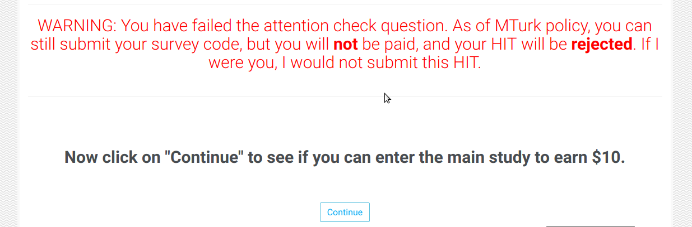

# Using formr to obtain quality data from MTurk
<br>

Crowdsourcing is one of the most popular solutions to recruit participants nowdays, especially in large projects with resources, although it has largely been critisised for the quality of data obtained. Workers appear to [misrepresent themselves](https://www.sciencedirect.com/science/article/pii/S0747563218300633). People successfully attempted to [use attention check items and high worker reputation](https://www.ncbi.nlm.nih.gov/pubmed/24356996), and less successfully worker reputation. In other instances, MTurk [outperforms panel data](https://www.tandfonline.com/doi/full/10.1080/00913367.2016.1269304). 

A new, R-based framework, [formr](formr.org) is not only suitable to host and conduct surveys, but also has multiple features to increase data quality and prevent bots and inattentive participants from soiling the data. In this post I attempt to list some of the measures a researcher can take. 

Most of these are preventive measures, so that you don't have to deal with angry MTurkers for having to reject their work. They can be pretty emotionally/verbally/extremely abusive if they are convinced they passed your attention check, even though you have evidence they didn't. This is Spartaaaaa! Avoid it if you can.

## Problem 1: attention check
Desperate people are capable of crazy things if they need your money. So they will very quickly click through your items without reading them, but this is the most common issue and the easiest to check in survey research. 

###What you can do
1. Check if the participant understands the instructions (to prevent random filling) by asking them to _Check "3" here_.
2. Check if participants reads the item, for example _"How often does the sun rise above the horison every day?"_ This can be easily inserted among items that require a Likert-type answer (Never-Very often)
In my screening I implemented one attention check item, and I rejected Workers who have failed this item. Here is the result of my batch: 
```{r att_check_failed, eval=T, results=T, echo=F}
mturk_all_data <- read.csv2(file="../../Data/mturk_full_data_180818.csv")
table(mturk_all_data$screen_attention_check_error)
```

And I only asked them the number of full weeks in a year - easy to google if they don't know by heart. They knew (consented) that I cannot approve them if they fail the item, but they complained nevertheless. So in my next batches I issued a warning if the failed the attention check, but they could still submit the HIT as per MTurk policy: 

Despite the warning, 2.02% of people submitted and got rejected inevitably. Why, people, why?? 

```{r read_data, eval=T, results=T, echo=F}

mturk_all_data$warned_att_check <- ifelse(mturk_all_data$source %in% c("mturk7b_check", "mturk8_check", "mturk9_check", 
                                                                       "mturk10_check", "mturk11_check"), "warned", "not warned")
round(prop.table(table(mturk_all_data$warned_att_check, mturk_all_data$screen_attention_check_error))*100, 2)
```

<br>

## Problem 2: country of sitting
One of the weakest point of MTurk is that people from other countries VPN into the USA (or wherever you want them to come from) and fill out the survey as if they were eating and breathing in the US. Apart from ethical issues this is problematic, because they will obviously not have the culcural background of someone actually living in the US. Requesters can buy US-only samples, but MTurk gets tricky here. They define "US Workers" as having a US ID and a utility bill on their name _when they register_. Then they can obviously decide to leave the US any time, or ~~sell~~ share their access code with someone outside the US. MTurk never checks their IP address (or that's what they say), just relies on the registration data. I collected about 1000 participants, when I first checked their IP address (which I collected with their consent). I was surprised to find that 6% of the workers were from outside the US! When I rejected a few of them, they got back to me saying that they are on holiday in Lima, or work through [scripts](https://earnrentmoneyonline.com/installing-using-amazon-mturk-scripts-dummies/) probably running via a server in El Salvador. Obviously, it is very difficult to tell the truth, therefore prevention is the best approach here, I think. 
Here is where my participants come from: 

```{r mturk_ip, eval=T, echo=F, warning=F, message=F, results=T}
table(mturk_all_data$ip_country)
```

###What you can do
At the very beginning of your study, check which country they come from. Here is my [spreadsheet](Check_location_blog.xlsx) as a sample (just make sure you insert your own ip_stack key for it to work). It is masked as a simple entry page when presented to the participants, but it actually collects and checks the country based on the IP address. Then in your run you can simply insert a "forward" loop in the run:
`survey_name$ip_check_item !="US"` <br>
and send them to a dead-end (called "stop" in the run) if they fail. 


<br>

By the way, there are a few entries that were submitted from the same IP address: 
```{r ip_address_multiple, echo=F, results=T, eval=T}
mturk_all_data <- read.csv2(file="../../Data/Raw_data/mturk_full_data_withIP_180818.csv")
table(as.data.frame(table(mturk_all_data$ip_address))[,2])

```
Even if I exclude those whom I know have submitted more than once (before I implemented the screening), there are a few multiple submissions from the same IP address, although not too many: 
```{r ip_address_exc_virgin, echo=F, results=T, eval=T}
mturk_all_data_exclvirgin <- mturk_all_data[mturk_all_data$survey_virgin == "passed", ]
table(as.data.frame(table(mturk_all_data_exclvirgin$ip_address))[,2])
```
It's difficult to tell if they are bots or not, because there are situations where people share the same internet connection (i.e. members of a family, students at the same campus, etc.) thus they will have the same IP address. 


## Problem 3: People fill out your survey more than once
Don't fool yourself: no-one remembers your survey the second after they submitted it. You cannot ask them not to fill it out twice, is your job to prevent people from doing this. It is possible to do via MTurk, but takes a little work every time you have a new batch. 

##What you can do
You cannot do this via a simple click, but there is a work-around. Basically, you need to create a qualification, that you assign to workers (i.e. You-have-filled-out-this-survey-before). Then when you order your next batch, exclude workers with this qualification (they will not see your survey popping up). MTurk has a very good [tutorial](https://blog.mturk.com/tutorial-best-practices-for-managing-workers-in-follow-up-surveys-or-longitudinal-studies-4d0732a7319b) for this. Obviously, you need to download-assign-reupload your spreadsheet every time after a batch is completed and you want to launch a new one. 

<br>

## Problem 4: Participants rush through the questions

Formr has a wonderful feature of recording the time of an item created (appeared for the user). Use this to check if they rush through too fast your survey. Perhaps not to reject your workers on MTurk, but you can definitely use this later to protect the integrity of the data by excluding participants who fill out your questionnaire too fast. Note that the time MTurk returns to you is the time between accepting and submitting the HIT, which includes the time of server load, reading consent, etc., thus much longer, than actually clicking thourough the items. 

###What you can do

```{r plot_time, eval=T, results=T, echo=F, message=F, warning=F, error=F}
library(tidyverse)

source("../../Scripts/not_approved_screening_sessions.R")  # to get rid of test sessions that mess up time data

# pull data from formr (survey/Show Results/Detailed Results/Export (as json file))
data_screen_time_raw <- as.data.frame(jsonlite::fromJSON("../../Data/Raw_data/screen_MTurk_itemdisplay_180818.json"), stringAsFactors=F)
data_screen_time_raw$created = as.POSIXct(strptime(data_screen_time_raw$created, "%Y-%m-%d %H:%M:%S"))
data_screen_time_raw <- data_screen_time_raw[str_length(data_screen_time_raw$session) > 1,]
data_screen_time_raw <- data_screen_time_raw[!(data_screen_time_raw$session %in% remove_test_sessions), ]

# get the time data from formr.org and measure the appearance of two items (first and last item/page) - the difference will the the time of filling out 
data_screen_time <- data_screen_time_raw %>%
  select(session, item_name, created) %>% 
  filter(item_name %in% c("gender", #which is the first item to display after consent
                          "note_mturk_code")) %>%  #which is the first item to display after submitting the last aswer
  spread(item_name, created) %>%
  mutate(screen_difftime = as.numeric(difftime(note_mturk_code, gender, unit = "secs"))) 

# read data
# mturk_all_data <- read.csv2(file="../../Data/mturk_full_data_180818.csv")

# the time values can sometimes be unreliable resulting in very large (larger than 5000 sec.) values and less than 0. This will be treated as noise and ignored when visualising.
mturk_all_data_difftime <- mturk_all_data[(mturk_all_data$screen_difftime > 0) & (mturk_all_data$screen_difftime < 2000),]

# visualise time needed to fill out the questionnaire
ggplot(data=mturk_all_data_difftime, aes(screen_difftime)) + 
  geom_histogram(aes(y=..density..), fill="grey", colour="black", binwidth = 3) +
  geom_vline(aes(xintercept = median(mturk_all_data_difftime$screen_difftime, na.rm = T)), col="red", size=1) +
  geom_text(aes(label=paste0("Median = ", round(mean(mturk_all_data_difftime$screen_difftime, na.rm = T), 1)), 
                y=-0.001, x=median(mturk_all_data_difftime$screen_difftime, na.rm=T))) +
  #geom_density(alpha=.2, fill="#FF6666") +
  ggtitle("Time needed to fill out the screening items (reading consent excluded)") +
  xlab("time (seconds)") +
  theme_linedraw()
```


## Problem 5: Server (formr.org) freezes
At this time the formr.org server has it's limitations, and you don't want your participants to get frustrated ~~becaue they will send you annoying emails~~. For this reason I limit my batch to 200 people, which does not substantially slow down the loading. Then re-publish the batch every few hours.

## Problem Level3444: bots
Things get really complicated if you want to punish bots but not humans. 

###What you can do
1. Bots cannot respond to content-related items. For example, you can ask your participant to describe a picture (or a short video) that you show them. Bots are likely to respond with something like "nice study", or "thanks for the opportunity to take part". Then use text mining, or look into the data manually to exclude suspicious responses.  
2. The best way to screen bots these days would obviously be to include a [reCAPTCHA](https://www.google.com/recaptcha/intro/v3beta.html) to the beginning of your survey. ReCAPTCHA identifies bots with very high accuracy, without being complicated for humans. Currently R has no package to help implementing it, and I also tried and failed creating it. But if anyone has a solution, please let me know! 


## Extra advice
* Allow plenty of time for participants to fill out your survey. My trial indicated that people take 2.5 minutes on average to fill out my survey, so I set a limit of 5 minutes. Wasn't a good idea. 
* Some particpants will submit nonsense instead of the survey code (often their MTurkID, or the amount you pay them). You can be light-hearted with them (or have your heart made of butter as we say in Hungarian), it is up to you, but then check the survey code on a one-to-one basis.  


